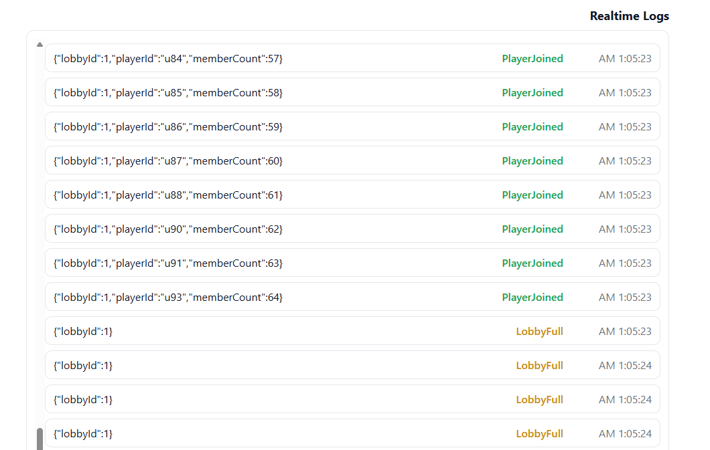
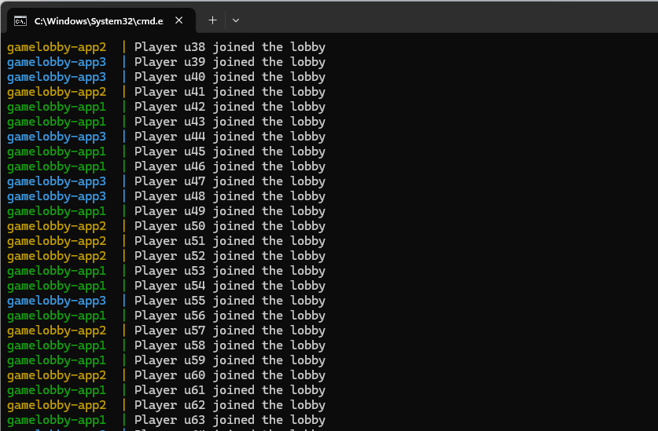

# 🎮 GameLobby – Distributed Multiplayer Lobby System (C# + Redis)

A lightweight **distributed lobby service** built in **.NET 8** with **Redis** as the in-memory data store.  
This service is designed to handle **high-concurrency multiplayer lobbies**, using Redis primitives for **fast coordination**, **state tracking**, and **atomic locking**.

---

## 🚀 Overview

GameLobby allows multiple application instances (pods/containers) to manage player lobbies together — all synchronized through a shared Redis instance.

Each **lobby** is a logical room that can be created, joined, or locked.  
Redis stores all lobby data (metadata, members, and indexes) and ensures that only one process modifies a lobby at a time using distributed locks.

---

## 🧱 Architectures & Technologies Used

| Category | Technologies / Patterns |
|-----------|-------------------------|
| 🧩 **Architecture** | **Clean Architecture** |
| 🧠 **Dependency Injection (DI)** | Built-in .NET DI container |
| 🌐 **REST API** | ASP.NET Core Controllers |
| 🔗 **SignalR (Real-Time)** | ASP.NET Core SignalR |
| ⚡ **Redis** | Redis 7 (In-memory data store) |
| 🧵 **Distributed Locking** | Lua scripts + `SET NX PX` |
| 🧰 **Docker & Compose** | Multi-container setup |
| 🧪 **Load Testing** | PowerShell (`RequestSender.ps1`) |

---
## 🧩 Core Features

| Feature | Description |
|----------|-------------|
| 🎯 **Lobby Creation** | Creates unique lobby IDs using `INCR`, stores metadata in a Redis `HASH`, and registers it in a `SET` index by status. |
| 👥 **Member Management** | Each lobby maintains a Redis `SET` of player IDs (`lobby:{id}:members`) for atomic joins/leaves. |
| 🔒 **Distributed Locking** | Uses Redis-based tokenized locks (`SET NX PX`) and a Lua unlock script to ensure safe unlocks. |
| 🧮 **Efficient Indexing** | Lobbies are grouped by status (e.g. open/locked/full) using indexed Sets (`lobby:by-status:{status}`). |
| ⚡ **High Performance** | In-memory operations only (no SQL), ideal for real-time or high-throughput multiplayer systems. |

---

## 🐳 How to Run the App (Docker Compose)

You can easily run **GameLobby** locally using **Docker Compose**.  
No manual setup is required — everything is containerized and auto-configured.

### 💠 Installation

From the project root (where `docker-compose.yml` is located):

```bash
docker compose up --build
```

---

## ⚙️ Running Multiple Instances

When you run the project using **Docker Compose**, it automatically starts **three instances** of the GameLobby app —  
each one mapped to a different port on your local machine.

| Instance | Container Name | Port | URL |
|-----------|----------------|------|------|
| 🟢 App #1 | `gamelobby-app1` | **5144** | [http://localhost:5144](http://localhost:5144) |
| 🟢 App #2 | `gamelobby-app2` | **5145** | [http://localhost:5145](http://localhost:5145) |
| 🟢 App #3 | `gamelobby-app3` | **5146** | [http://localhost:5146](http://localhost:5146) |

All instances share the same **Redis** container, ensuring that lobby data and locks remain synchronized across all pods.

---

## 🌐 Real-Time Notifier (SignalR Demo)

You can open the following page in your browser to see the **real-time WebSocket demo** powered by **SignalR**:

👉 [http://localhost:5145/lobby.html](http://localhost:5145/lobby.html)

This page connects to one of the running GameLobby instances through **SignalR**.  
Whenever a **player joins a lobby**, all connected clients — across all three running instances (`5144`, `5145`, `5146`) — receive an instant update that shows:

- 👤 Which player joined  
- 🎯 Which lobby they joined  
- 🔁 And all connected players are updated **in real-time**

It demonstrates **distributed, synchronized communication** between multiple app instances using Redis + SignalR.

---

### 🖼️ Example Output

Below is an example of the real-time updates in action:




---

## 🧪 Load Testing with `RequestSender.ps1`

To send **hundreds of simultaneous join requests** to all **three running instances** (`5144`, `5145`, `5146`), follow these steps:

1. **Create a lobby** and note its lobby ID.  
2. **Open** the file `RequestSender.ps1` and set your lobby ID at the top of the script:
   ```powershell
   $lobbyId = 1
   ```
3. In the same folder, run the following command in **PowerShell**:
   ```powershell
   powershell -ExecutionPolicy Bypass -File .\RequestSender.ps1
   ```
4. After a few seconds, the script will send **100 join requests** distributed across all instances.  
   Only the **first 64 players** will successfully join — based on the default lobby capacity.

You can observe live updates on the notifier page:  
👉 [http://localhost:5145/lobby.html](http://localhost:5145/lobby.html)

---
---

## 🧩 Overall App Result

The image below shows the **final result of the GameLobby system** after running the load test.  
As seen in the logs, players joined from **three different instances** (`5144`, `5145`, `5146`).  
When the lobby reached its **capacity limit of 64 players**,  
its **status automatically changed to `Full`**, and the system **rejected all further join attempts** —  
keeping all instances perfectly synchronized through Redis.


